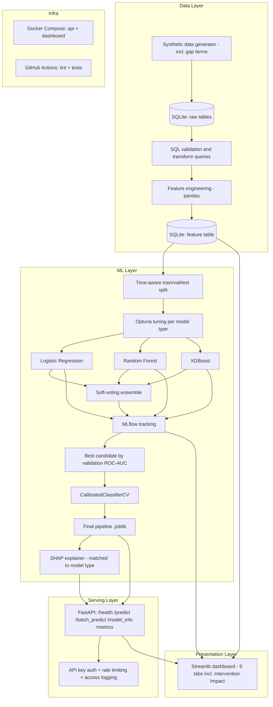

# Architecture

## Component notes

- **Synthetic data generator** produces multi-term student-enrollment records with
  realistic, documented distributions, including stop-out-and-return (gap-term)
  behavior (see `data/DATA_DICTIONARY.md`). This is the only dataset used for
  training — a UCI-dataset benchmark was considered during planning but never built
  (see the README's Data section for that honest correction).
- **SQLite** is used for both raw storage and the feature table, chosen for zero
  external infra and easy portability in a portfolio context. The schema is written
  in plain SQL (`db/schema.sql`) so migrating to PostgreSQL later is a connection-string
  change, not a rewrite.
- **Optuna** tunes each model type's hyperparameters (maximizing validation ROC-AUC)
  before comparison; a soft-voting ensemble over the tuned models is evaluated as one
  more candidate and wins the final selection only if it genuinely beats every
  individual model.
- **MLflow** tracks every tuning trial's parameters, metrics, and artifacts so no
  reported metric is hand-typed — it's queried from actual run logs.
- **CalibratedClassifierCV** corrects a measured probability-calibration distortion
  from class weighting, fit on the validation set only, before the final test
  evaluation.
- **FastAPI** loads the serialized model + SHAP explainer once at startup and serves
  predictions plus explanations, behind optional API-key auth, per-endpoint rate
  limits, structured access logging, and a Prometheus `/metrics` endpoint.
- **Streamlit** dashboard is a separate process that reuses the same model/explainer
  code directly (not over HTTP) for exploration, including a sensitivity-analysis tab
  for simulated intervention impact.
