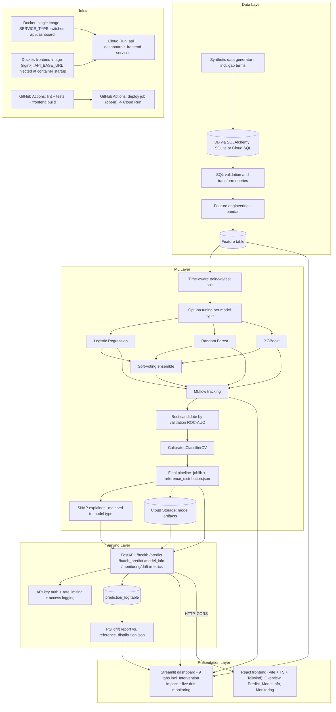

# Architecture

## Component notes

- **Synthetic data generator** produces multi-term student-enrollment records with
  realistic, documented distributions, including stop-out-and-return (gap-term)
  behavior (see `data/DATA_DICTIONARY.md`). This is the only dataset used for
  training — a UCI-dataset benchmark was considered during planning but never built
  (see the README's Data section for that honest correction).
- **SQLite by default, PostgreSQL/Cloud SQL when `DATABASE_URL` is set** — a single
  SQLAlchemy engine (`db.py`) every script uses, so the database backend is a
  connection-string change, not a fork in the code. The schema is written in plain SQL
  (`db/schema.sql`).
- **Optuna** tunes each model type's hyperparameters (maximizing validation ROC-AUC)
  before comparison; a soft-voting ensemble over the tuned models is evaluated as one
  more candidate and wins the final selection only if it genuinely beats every
  individual model.
- **MLflow** tracks every tuning trial's parameters, metrics, and artifacts so no
  reported metric is hand-typed — it's queried from actual run logs.
- **CalibratedClassifierCV** corrects a measured probability-calibration distortion
  from class weighting, fit on the validation set only, before the final test
  evaluation.
- **FastAPI** loads the serialized model + SHAP explainer once at startup and serves
  predictions plus explanations, behind optional API-key auth, per-endpoint rate
  limits, structured access logging, and a Prometheus `/metrics` endpoint.
- **Streamlit** dashboard is a separate process that reuses the same model/explainer
  code directly (not over HTTP) for exploration, including a sensitivity-analysis tab
  for simulated intervention impact.
- **Monitoring**: every scored request is best-effort logged to a `prediction_log`
  table; `/monitoring/drift` and the dashboard's Monitoring tab compare recently
  logged requests against `reference_distribution.json` (saved by `train.py`) using
  the Population Stability Index, falling back to an illustrative train/test
  comparison until enough live traffic has been logged.
- **Cloud Storage** persists model artifacts (including the drift reference) since
  Cloud Run's container filesystem is ephemeral — optional, gracefully disabled when
  `GCS_BUCKET_NAME` is unset.
- **CI/CD**: GitHub Actions runs lint + the full test suite (and, in a separate job,
  the frontend's lint/test/build) on every push/PR; a third, opt-in job redeploys all
  three Cloud Run services automatically after tests pass on a push to `main`.
- **React frontend** (`frontend/`) is a separate SPA (Vite + TypeScript + Tailwind)
  calling the FastAPI backend over HTTP/CORS — a product-style UI alongside the
  Streamlit dashboard, not a replacement for it. Gets the API's base URL from a
  runtime-injected `window.__ENV__` (written by its own `docker-entrypoint.sh` from an
  `API_BASE_URL` env var at container startup) rather than a Vite build-time variable,
  so the same built image works against any backend without rebuilding — necessary
  because Cloud Run doesn't assign the API's URL until after it's deployed.
