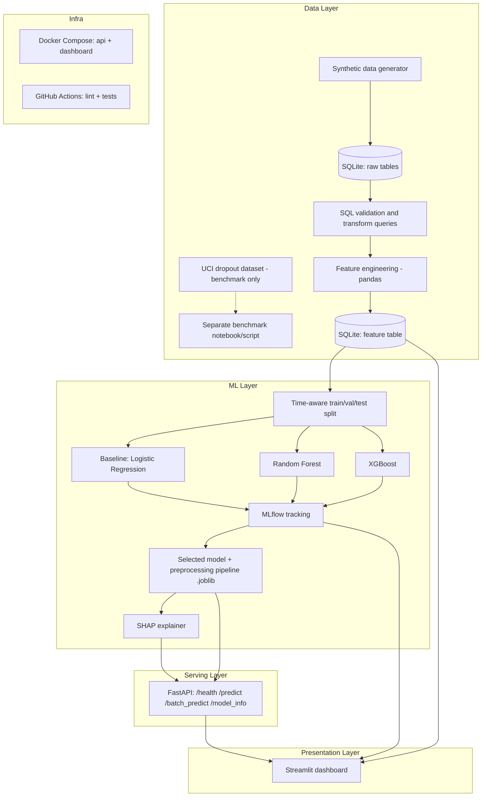

# Architecture

## Component notes

- **Synthetic data generator** produces multi-term student-enrollment records with
  realistic, documented distributions (see `data/DATA_DICTIONARY.md`). This is the
  primary dataset for training.
- **UCI dropout dataset** is used only as an external benchmark in Phase 3, to check
  whether the modeling approach (feature types, model choice, evaluation method)
  transfers to a real, independently-collected dataset. It is not merged into the
  primary pipeline and is not used to make claims about the synthetic model's
  real-world accuracy.
- **SQLite** is used for both raw storage and the feature table, chosen for zero
  external infra and easy portability in a portfolio context. The schema is written
  in plain SQL (`db/schema.sql`) so migrating to PostgreSQL later is a connection-string
  change, not a rewrite.
- **MLflow** tracks every training run's parameters, metrics, and artifacts so no
  reported metric is hand-typed — it's queried from actual run logs.
- **FastAPI** loads the serialized model + preprocessing pipeline once at startup and
  serves predictions plus SHAP-based explanations.
- **Streamlit** dashboard is a separate process that either calls the FastAPI service
  or loads the model directly for exploration — decided in Phase 6.
